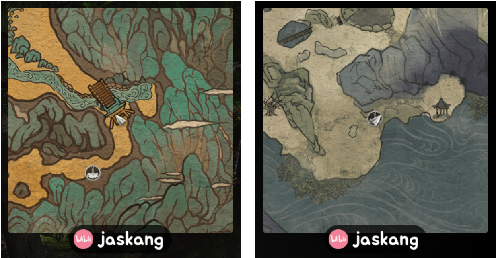
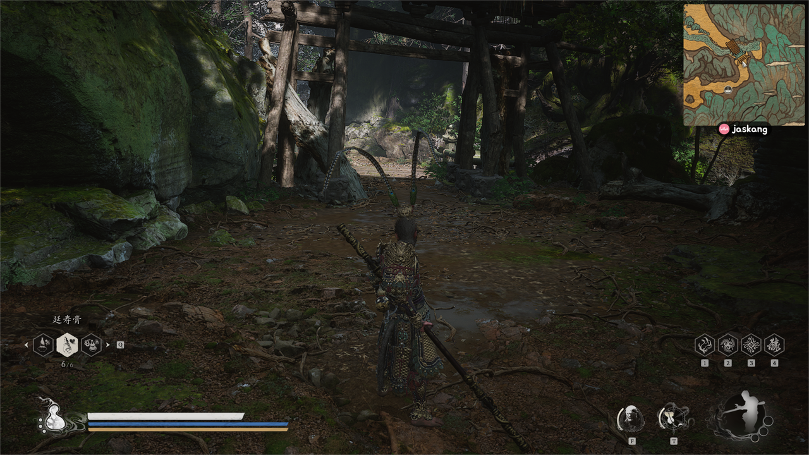
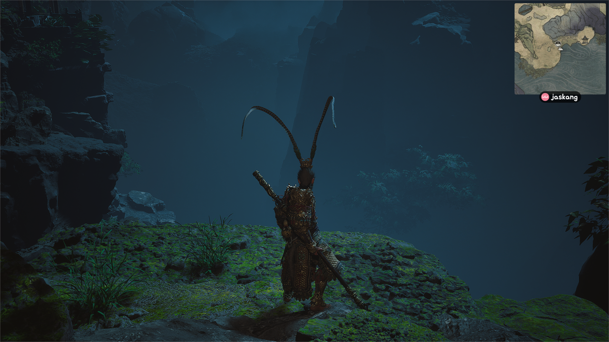
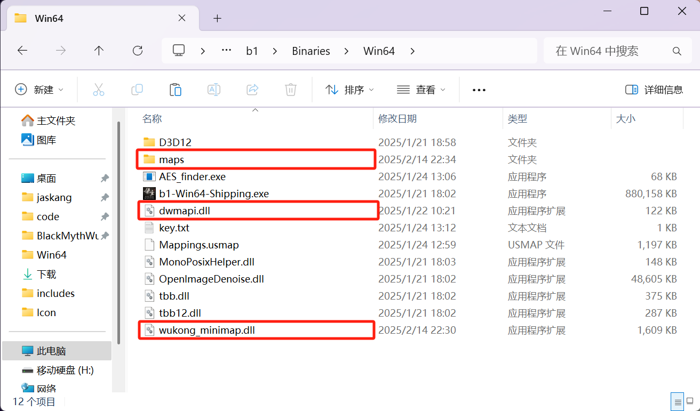

# Black Myth: Wukong - Built-in Real-time Map

A minimap plugin for Black Myth: Wukong that provides real-time location tracking and navigation features. It's free~free~free~

- Download: [releases](https://github.com/jaskang/wukong-minimap/releases)
- BiliBli Demo Video：[程序员自费开发黑神话小地图，精准还原行旅图～](https://www.bilibili.com/video/BV1Y1KueREho/?share_source=copy_web&vd_source=dcfc3e9cca2640bbaa21c24979c4c34b)
- GitHub: [Please help me click star](https://github.com/jaskang/wukong-minimap)
- Nexusmods: [Don't forget to recommend it](https://www.nexusmods.com/blackmythwukong/mods/1172)

切换语言: [中文](README.md)

## Changelog

- v1.7
  - 调整 UI
  - 添加大量点位
- v1.6
  - Fixed AMD GPU rendering issues
  - Added map points

## 按键说明：

- `+` Zoom in the minimap window
- `-` Zoom out the mini-map window
- `Shift` + `+` Zoom in the mini-map scale
- `Shift` + `-` Zoom out the mini-map scale
- `0` Show/Hide the map

## Demo Screenshots

## Installation Instructions

Extract `wukong-minimap.zip` directly to the `b1\Binaries\Win64` folder under Black Myth's installation directory (Steam installation folder can be found by right-clicking Black Myth -> Manage -> Browse Local Files)

This plugin includes the following files:

- `wukong_minimap.dll` Core plugin functionality file
- `dwmapi.dll` Loader - Loads wukong_minimap.dll by proxying system functions
- `maps` Map folder

If you have other means to load `wukong_minimap.dll`, you can completely skip `dwmapi.dll`

## For UE4SS Users

Since ue4ss's built-in `dwmapi.dll` intercepts system APIs which prevents the plugin from loading properly, we just use the dwmapi.dll from wukong-minimap.

## Uninstallation

Simply delete the `wukong_minimap.dll` file.

## WeChat Group

