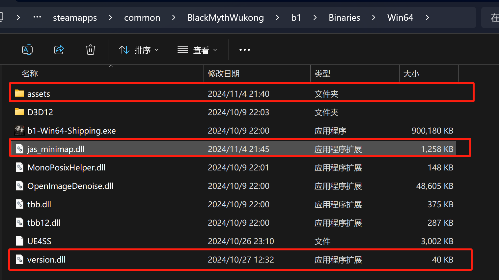
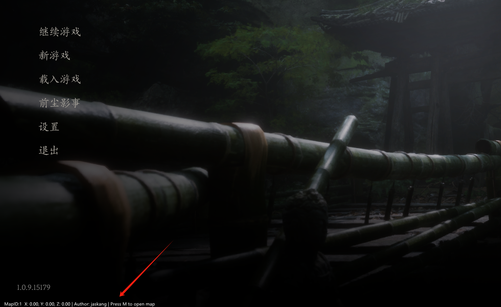

# 黑神话·悟空-内置实时地图

该插件为是我学习 Rust 的练手项目，基于[imgui](https://github.com/ocornut/imgui) 和 [hudhook](https://github.com/veeenu/hudhook?from=jaskang)库开发。

注意：该项目为免费开源工具请勿用作商业用途，作者不承担任何责任。

 

## 使用方法

### 1. 下载并安装压缩包 

### 2. 将文件解压到游戏目录

游戏目录一般为：`[steam安装目录]\steamapps\common\BlackMythWukong\b1\Binaries\Win64`

自定义安装位置的玩家请自行查找游戏目录，将文件解压到 `BlackMythWukong\b1\Binaries\Win64` 目录下

完成后，目录下应包含如下文件：
- BlackMythWukong/b1/Binaries/Win64
  - version.dll - 代理库用于加载地图插件
  - jas_minimap.dll - 地图插件
  - assets - 地图资源文件

 

### 3. 运行游戏，会看到游戏左下角出现文字信息表示地图插件已加载

 

### 4. 游戏中按 `M` 键可开启大地图

 

## 完善地图数据

玩家在游戏中发现地图或点位信息错误，可截图反馈在 [issue](https://github.com/jaskang/jas_minimap/issues) 中，作者会及时更新

## 打赏

如果本插件对你有帮助，请作者喝杯咖啡吧

