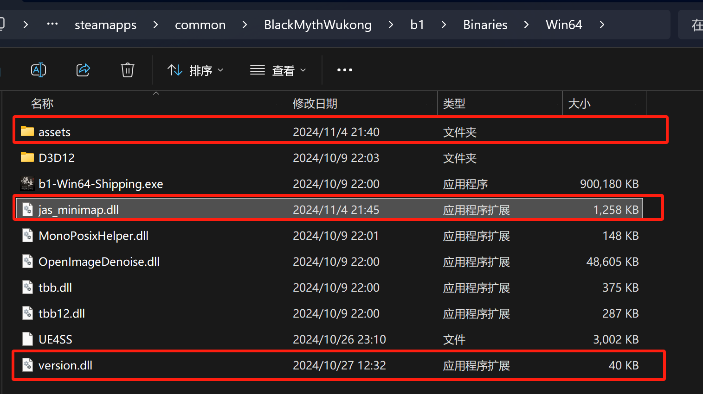
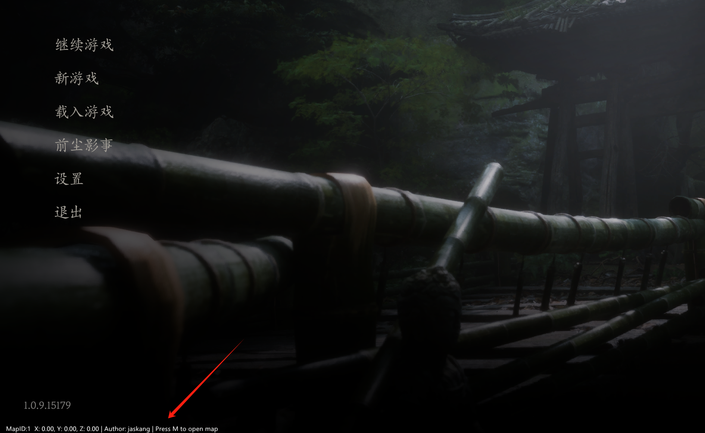

# 黑神话·悟空-内置实时地图

该插件是本人学习 Rust 的练手项目，基于[imgui](https://github.com/ocornut/imgui) 和 [hudhook](https://github.com/veeenu/hudhook?from=jaskang)库开发。该项目为免费开源请勿用作商业用途，作者不承担任何责任。

## 使用方法

### 1. 下载插件

github 下载: [https://github.com/jaskang/black-myth-map/releases](https://github.com/jaskang/black-myth-map/releases)

nexusmods 下载: [https://www.nexusmods.com/blackmythwukong/mods/956](https://www.nexusmods.com/blackmythwukong/mods/956)

### 2. 将文件解压到游戏目录

游戏目录一般为：`[steam安装目录]\steamapps\common\BlackMythWukong\b1\Binaries\Win64`

自定义安装位置的玩家请自行查找游戏目录，将文件解压到 `BlackMythWukong\b1\Binaries\Win64` 目录下

完成后，目录下应包含如下文件：

- BlackMythWukong/b1/Binaries/Win64
  - version.dll - 代理库用于加载地图插件
  - jas_minimap.dll - 地图插件
  - assets - 地图资源文件

### 3. 运行游戏，会看到游戏左下角出现文字信息表示地图插件已加载

### 4. 游戏中按 `M` 键可开启大地图

## 完善地图数据

玩家在游戏中发现地图或点位信息错误，可截图反馈在 [issue](https://github.com/jaskang/jas_minimap/issues) 中，作者会及时更新

## 常见问题

- version.dll
  
  version.dll 本身不包含任何功能逻辑仅仅用来加载 jas_minimap.dll，所以您完全可以使用其他任何方式注入 jas_minimap.dll。
  
- CSharpLoader 冲突
  
  CSharpLoader 同样使用了 version.dll 作为入口，它对 version.dll 冲突做了兼容：
  将 jas_minimap.dll 和 assets 文件夹 一起放到CSharpLoader/Plugins/目录里，CSharpLoader 会一起加载这些插件。这样本插件的 version.dll 就不需要了。
  相关文档：[CSharpLoader 相关文档链接](https://github.com/czastack/B1CSharpLoader?tab=readme-ov-file#%E4%B8%8E%E5%85%B6%E4%BB%96%E6%8F%92%E4%BB%B6%E7%9A%84%E5%85%BC%E5%AE%B9)

## 打赏

如果本插件对你有帮助，请作者喝杯咖啡吧

