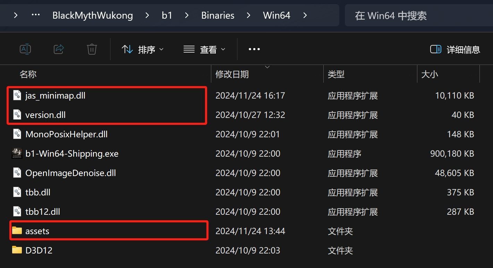

# 黑神话·悟空-内置实时地图

Switch language: [English](README.en.md)

该插件是本人学习 Rust 的练手项目，基于[imgui](https://github.com/ocornut/imgui) 和 [hudhook](https://github.com/veeenu/hudhook?from=jaskang)库开发。该项目为免费开源请勿用作商业用途，作者不承担任何责任。

如果这个插件对您有所帮助，请帮我点个 star

Nexusmods 地址: [https://www.nexusmods.com/blackmythwukong/mods/956](https://www.nexusmods.com/blackmythwukong/mods/956)

> 点击图片跳转至 B 站演示视频

### 按键说明

键盘：`M` 键打开/关闭大地图，`N` 键开启/关闭 HUD
手柄：`Select` 键打开/关闭大地图

#### 纯净安装

1. 下载 Mod: [https://github.com/jaskang/black-myth-map/releases](https://github.com/jaskang/black-myth-map/releases)

2. 将 BlackMythMap.zip 直接解压至黑神话的安装文件夹下面的 `b1\Binaries\Win64` 中 (steam的安装文件夹可以通过右键黑神话 -> 管理 -> 浏览本地文件找到) 

#### 使用 CSharpLoader 的用户

1. 下载 Mod: [https://github.com/jaskang/black-myth-map/releases](https://github.com/jaskang/black-myth-map/releases)

2. 将 BlackMythMap.zip 直接解压至黑神话的安装文件夹下面的 `b1\Binaries\Win64\CSharpLoader\Plugins` 中, 并删除 version.dll 文件。

### 卸载

将 b1\Binaries\Win64\jas_minimap.dll 文件删除即可

### 完善地图数据

玩家在游戏中发现地图或点位信息错误，可截图反馈在 [issue](https://github.com/jaskang/jas_minimap/issues) 中，作者会及时更新

### 打赏

如果本插件对你有帮助，请作者喝杯咖啡吧

