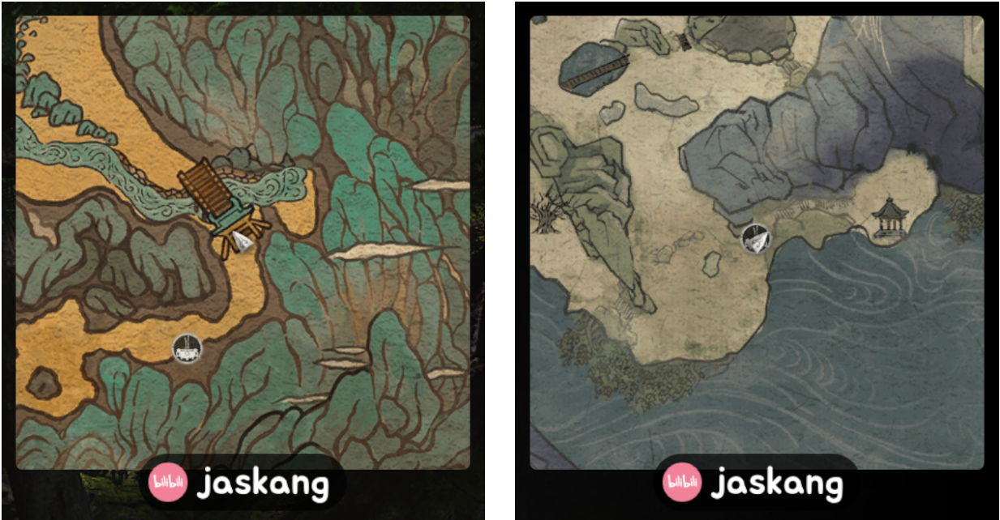

# 黑神话·悟空-内置实时地图

一个为《黑神话：悟空》设计的小地图插件，提供实时位置追踪和导航功能。是免费的~免费的~免费的~

该插件是本人学习 Rust 的练手项目，基于[imgui](https://github.com/ocornut/imgui) 和 [hudhook](https://github.com/veeenu/hudhook?from=jaskang)库开发。该项目为免费开源请勿用作商业用途，作者不承担任何责任。

- 下载地址: [releases](https://github.com/jaskang/wukong-minimap/releases)
- BiliBli 演示视频：[我开发了一款黑神话悟空小地图插件，精准还原行旅图 免费开源～](https://www.bilibili.com/video/BV1FxrTYeEaA/?share_source=copy_web&vd_source=dcfc3e9cca2640bbaa21c24979c4c34b)
- GitHub 源代码: [请帮我点个 star](https://github.com/jaskang/wukong-minimap)
- Nexusmods: [别忘了推荐一下](https://www.nexusmods.com/blackmythwukong/mods/956)

Switch language: [English](README.en.md)

## 更新日志

- v1.4
  - 支持调整地图大小， `\ = ` 放大 `\ - ` 缩小
- v1.3
  - 修改渲染方式
  - 切换加载器，优化与 ue4ss 的兼容能力，解决 charploader 冲突问题
    这个版本修改了插件的文件名，请先删除旧版本文件 jas_minimap.dll、version.dll
- v1.2
  - 添加错误日志输出
  - 尝试调整渲染参数
- v1.0
  - 更新官方行旅图
  - 修改渲染方式

## 演示截图

## 安装说明

将 `wukong-minimap.zip` 直接解压至黑神话的安装文件夹下面的 `b1\Binaries\Win64` 中 (steam 的安装文件夹可以通过右键黑神话 -> 管理 -> 浏览本地文件找到)

本插件包含以下文件：

- `wukong_minimap.dll` 插件功能核心文件
- `dwmapi.dll` 加载器 - 通过代理系统功能来加载 wukong_minimap.dll
- `maps` 地图文件夹

> 旧版本为 `jas_minimap.dll` -> `wukong_minimap.dll` 和 `version.dll` -> `dwmapi.dll`

如果您有其他的方式可以用于加载 `wukong_minimap.dll` ，完全可以无需 `dwmapi.dll`

## 使用 CSharpLoader 的用户

从 v1.3 开始兼容 CSharpLoader 无需特殊处理， v1.3 以前版本请删除 CSharpLoader\Plugins 中的旧文件 wukong_minimap.dll。

## 使用 UE4SS 的用户

由于 ue4ss 自带的 `dwmapi.dll` 拦截了系统 api 会导致插件无法顺利加载，我们使用 wukong-minimap 中的 dwmapi.dll 就行了。

## 卸载

删除 `wukong_minimap.dll` 文件即可，小于 v1.3 版本删除 `jas_minimap.dll`、`version.dll`、`assets`

## 微信群交流群

