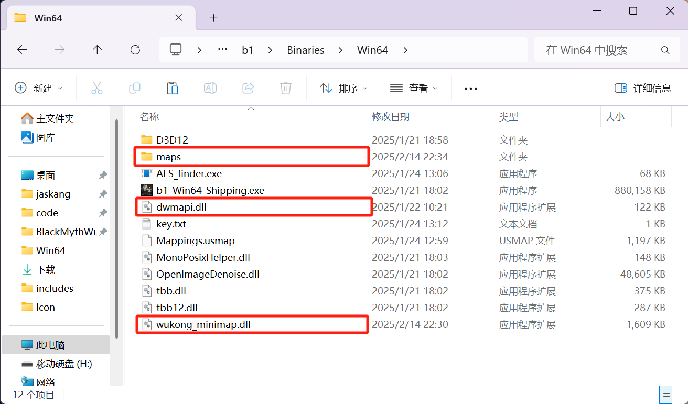

# 黑神话·悟空-内置实时地图

一个为《黑神话：悟空》设计的小地图插件，提供实时位置追踪和导航功能。是免费的~免费的~免费的~ 请帮我点个 star!

- 下载地址: [releases](https://github.com/jaskang/wukong-minimap/releases)
- BiliBli 演示视频：[程序员自费开发黑神话小地图，精准还原行旅图～](https://www.bilibili.com/video/BV1Y1KueREho/?share_source=copy_web&vd_source=dcfc3e9cca2640bbaa21c24979c4c34b)
- GitHub 源代码: [请帮我点个 star](https://github.com/jaskang/wukong-minimap)
- Nexusmods: [别忘了推荐一下](https://www.nexusmods.com/blackmythwukong/mods/1172)

Switch language: [English](README.en.md)

## 更新日志

- v1.6
  - 修复 AMD 显卡渲染问题
  - 添加点位

## 按键说明：

- `+` 放大 小地图窗口
- `-` 缩小 小地图窗口
- `Shift` + `+` 放大 小地图比例
- `Shift` + `-` 缩小 小地图比例
- `0` 显示/隐藏 地图

## 演示截图

## 安装说明

将 `wukong-minimap.zip` 直接解压至黑神话的安装文件夹下面的 `b1\Binaries\Win64` 中 (steam 的安装文件夹可以通过右键黑神话 -> 管理 -> 浏览本地文件找到)

本插件包含以下文件：

- `wukong_minimap.dll` 插件功能核心文件
- `dwmapi.dll` 加载器 - 通过代理系统功能来加载 wukong_minimap.dll
- `maps` 地图文件夹

## 使用 UE4SS 的用户

由于 ue4ss 自带的 `dwmapi.dll` 拦截了系统 api 会导致插件无法顺利加载，我们使用 wukong-minimap 中的 dwmapi.dll 就行了。

## 卸载

删除 `wukong_minimap.dll` 文件即可

## 附录

- [imgui](https://github.com/ocornut/imgui)
- [hudhook](https://github.com/veeenu/hudhook?from=jaskang)
